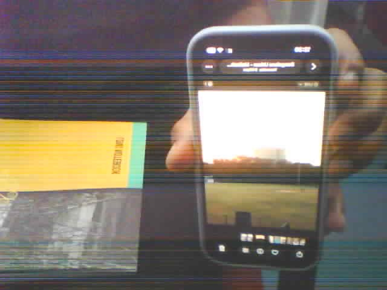

# ESP32-CAM Wireless Video Streaming

This folder contains the source code and resources for the ESP32-CAM wireless video streaming project.

## 📸 Hardware Circuit Diagram


*Circuit diagram showing the FTDI-to-ESP32-CAM wiring for programming and operation.*

## 🖼️ Sample Images



*Sample image captured with the ESP32-CAM module.*

## 📁 Project Structure

```
ESP32-CAM-Wireless-Streaming/
├── images/          # Circuit diagrams and test images
├── src/             # Arduino source code
│   └── CameraWebServer.ino
└── README.md        # This file
```

## 🚀 Quick Start

1. **Hardware Setup**: Connect ESP32-CAM to FTDI programmer as shown in the circuit diagram
2. **Upload Code**: Open `src/CameraWebServer.ino` in Arduino IDE
3. **Configure WiFi**: Set your WiFi credentials in the code
4. **Upload**: Put ESP32-CAM in programming mode (GPIO0 to GND) and upload
5. **View Stream**: Access the IP address shown in Serial Monitor

## ⚙️ Key Features

- Real-time MJPEG video streaming
- 25-30 FPS @ QVGA resolution
- Web-based camera controls
- PSRAM-enabled double buffering
- Stable WiFi connectivity

## 📖 Full Documentation

For complete documentation, hardware requirements, troubleshooting, and more, please refer to the [main README](../README.md) at the repository root.

## 📝 License

MIT License - See [LICENSE](../LICENSE) for details
